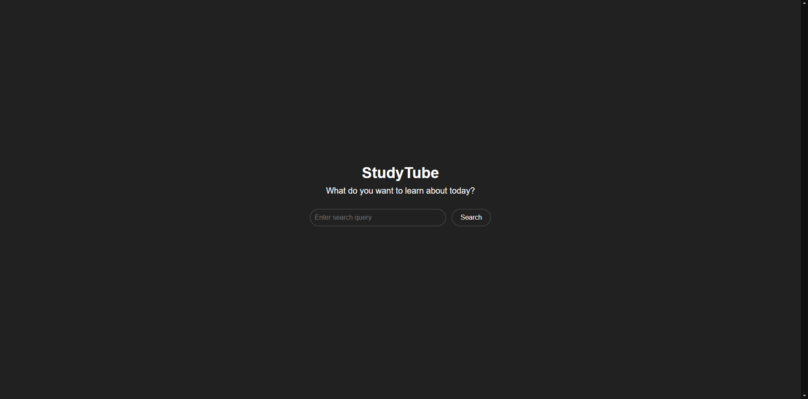

# 📚 | StudyTube

StudyTube is a Chrome extension that helps you study better by providing a distraction-free environment on YouTube.

## 💾 | Installation

- Open your browser and go to the extension settings.

- In the top right corner click on the "enable developer mode" button.

- Click on the "load unpacked" button in the top left corner.

- Select the path to the extension. (this folder)

- The extension should appear in the menu.

## ⚙️ | How it works

StudyTube replaces the normal YouTube user interface with a custom one, so there are no distractions. After searching for a topic, the extension will show you the results, but not the random recommendations, like short reels or "You may also like..." div's.

## 🖼️ | Screenshot

## ✉️ | Questions

If you have any questions you can contact me on Discord: @nikitafrfr

If you came here from the Hackclub Slack, you can just contact me there :)